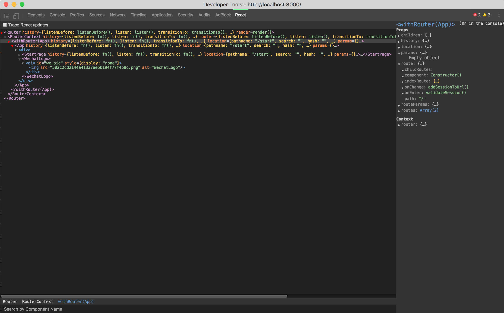

# React DevTools with Tomorrow Theme

This is a Tomorrow-themerized React DevTools that fits to Zero Dark Matrix Chrome DevTools Theme.

[React DevTools](https://github.com/facebook/react-devtools) is a pretty cool tool from facebook. But its chrome extension is not suitable for [Zero Dark Matrix Chrome DevTools Theme](https://github.com/mauricecruz/chrome-devtools-zerodarkmatrix-theme).

So I hacked the compiled code of the extension to modify its colors to [Tomorrow](https://github.com/chriskempson/tomorrow-theme)  theme.

And re-design the icons.

## How to use it 

You just `git clone` them and add it as unpacked extension within Developer mode in Chrome.

